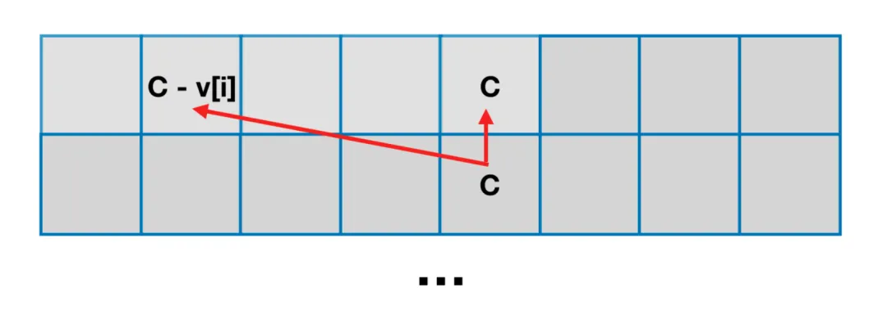

[oi-wiki](https://oi-wiki.org/)

[科学刷题](https://leetcode.cn/discuss/post/3141566/ru-he-ke-xue-shua-ti-by-endlesscheng-q3yd/)

[链表](https://leetcode.cn/problem-list/linked-list/)
> 虚拟头节点 + 头插法修改next指向
>
> 2487、29

[双向链表](https://leetcode.cn/problem-list/doubly-linked-list/)

[动态规划](https://leetcode.cn/problem-list/dynamic-programming/)

[KMP图解](https://www.zhihu.com/question/21923021/answer/37475572)
> 本质是减少不匹配时迭代匹配次数（暴力是每次从当前 i+1 匹配，KMP就是减少该次数）
> next数组 即 k（k < len）个的 前后缀相同的 字符串数目 如： 对于 abcab 则 k = 2，详细如下：
> 
> 已知next[i-1]，即前i-1个字符串字串前后缀有两个相同的 abc...ab?,则 
>   
>    1. 若 s[next[i-1]] = s[2] = 'c' = s[i] = ? = 'c' 则next[i] = next[i-1] +1
>    2. 若不相等，如：abcabd...abcabx，则需要获取abcab的next值: abc与abx比较 发现 c与x不同，则再回退
> 获取 ab的next值: 0 则停止，next[i] = 1,若x = c,则next[i] = 3 
>
```java
int[] calculateMaxMatchLengths(String pattern) {
    int[] maxMatchLengths = new int[pattern.length()];
    int maxLength = 0;
    for (int i = 1; i < pattern.length(); i++) {
        while (maxLength > 0 && pattern.charAt(maxLength) != pattern.charAt(i)) {
            maxLength = maxMatchLengths[maxLength - 1]; // ①
        }
        if (pattern.charAt(maxLength) == pattern.charAt(i)) {
            maxLength++; // ②
        }
        maxMatchLengths[i] = maxLength;
    }
    return maxMatchLengths;
}
```

```java
List<Integer> search(String text, String pattern) {
    List<Integer> positions = new ArrayList<>();
    int[] maxMatchLengths = calculateMaxMatchLengths(pattern);
    int count = 0;
    for (int i = 0; i < text.length(); i++) {
        while (count > 0 && pattern.charAt(count) != text.charAt(i)) {
            count = maxMatchLengths[count - 1];
        }
        if (pattern.charAt(count) == text.charAt(i)) {
            count++;
        }
        if (count == pattern.length()) {
            positions.add(i - pattern.length() + 1);
            count = maxMatchLengths[count - 1];
        }
    }
    return positions;
}
```


> 组合数计算：(r - l + 1) * (r - l) / 2

#### 枚举技巧
> 双变量 i,j：一次遍历 遍历过程使用哈希表记录已经遍历的值，利用这些哈希表内的值进行计算
> 
> 1、2441、1512

> 三变量 i<j<k 则枚举j这样就可以直接满足条件了
> 和双变量不同的在于需要 有一个j到k直接的数据关系如：2909 需要知道j到k直接的最小值 就是后缀数组的最小值，然后j到k的确定后，i到j就是双变量了
> 
> 2909 


#### 定长滑动窗口 （最大最长）
> 对于定长k，先初始移动满足窗口大小等于k,然后后续移动就是 处理前一个刚进入窗口的元素和最后一个离开窗口的元素。 见：1456
> 关键在于 '入'与’进‘的处理 比如：进 +1， 出 需要-1
> 
##### 求最短最小

##### 求子数组个数
> 越长越合法
```java
    class Solution {
        public int numberOfSubstrings(String s) {
            // 滑动窗口：含a、b、c至少各1次
            int[] cnt = new int[3];
            char[] ss = s.toCharArray();
            int n = s.length(), res = 0;
            for (int i = 0, j = 0; j < n; j++) {
                cnt[ss[j] - 'a']++;
                while (cnt[0] > 0 && cnt[1] > 0 && cnt[2] > 0) {
                    cnt[ss[i++] - 'a']--;
                    res += n - j;  // [i..j]已经满足了, 右边界[j..n-1]肯定都可以
                }
            }
            return res;
        }
    }
```
> 越短越合法 

> 恰好型
> 即两次 越长越合法相减  == => >= - >
```java
    public static int numSubarraysWithSum2(int[] nums, int goal) {
        int l1 = 0, l2 = 0, len = nums.length, ans = 0, s1 = 0, s2 = 0;
        for (int i = 0; i < len; i++) {
            s1 += nums[i];
            s2 += nums[i];
            // >= - >
            while (s1 > goal && l1 <= i) {
                s1 -= nums[l1++];
            }
            while (s2 >= goal && l2 <= i) {
                s2 -= nums[l2++];
            }
            ans += l2 - l1;
        }
        return ans;
    }
```

#### 回文串 (Manacher's Algorithm)
> Manacher's Algorithm
>


#### 位运算
> 想象成滚动的 如：32位 0000000.....001 逐个往右移动判断最后一位是否为0或1。
> 并集 a | b
> 交集 a & b
> 差集（子集）  a ^ b
> 差集（非子集） a & ~b
> 包含于   a & b = a  或  a | b = b
> 
> Integer.bitCount(s) 对应二进制1的数目
> 32-Integer.numberOfLeadingZeros(s) 对应二进制长度
> 31-Integer.numberOfLeadingZeros(s)   最大元素
> Integer.numberOfTrailingZeros(s)   最小元素
> 
> & 两位同时为1，结果才为1，否则为0
> | 参与运算的两个数据只要有一个值为1 那么值为1
> ^ 参加运算的两个对象，如果两个相应位值不同，则该位结果为1，否则为0


#### 模运算
> 记住二进制： 除以2 等价于 右移操作 >>1
> 
> 巧用 n&(n-1) 
> 
>    (n−1) 作用： 二进制数字 n 最右边的 1 变成 0 ，此 1 右边的 0 都变成 1 。
>    8 4 2 1 
>       6：110   5：101
> 
>    n&(n−1) 作用： 二进制数字 n 最右边的 1 变成 0 ，其余不变。
> 
> 直接通过二进制 Int长度来遍历， for (int i = 0; i < 31; i++)
> 对于x 只有二进制全为1 才可以进位 x+1。如：3 => 011; 3+1 = 4   => 100

> (a + b) % m  = (a % m  + b % m) % m
> (a * b) % m = ((a % m) * (b % m)) % m
> 对于任意x 取模： (x % m + m) % m
> 除数取模：(a/b) mod p  = (a*b的p-2平方) mod p
>
> 快速幂： 将x转为二进制 不断右移位 如果当前位是1 直接乘当前幂
> -n为 负数取反+1 
```java
class Solution {
    public double myPow(double x, int N) {
        double ans = 1;
        long n = N;
        if (n < 0) { // x^-n = (1/x)^n
            n = -n;
            x = 1 / x;
        }
        while (n != 0) { // 从低到高枚举 n 的每个比特位
            if ((n & 1) == 1) { // 这个比特位是 1
                ans *= x; // 把 x 乘到 ans 中
            }
            x *= x; // x 自身平方
            n >>= 1; // 继续枚举下一个比特位
        }
        return ans;
    }
}
```


### 前缀和
> 有些题目在动态规划里了
[详解](https://leetcode.cn/problems/range-sum-query-immutable/solutions/2693498/qian-zhui-he-ji-qi-kuo-zhan-fu-ti-dan-py-vaar/)
> 前缀和数组：    快速求区间和
```java
    /* 对于数组：a = [1,2,3,4,5,6]
        s[0] = 0
        s[1] = a[0]
        s[2] = a[0] + a[1]
        ...
        s[n] = a[0] + a[1] + ... + a[n]
        
        上诉a数组对于的前缀和数组：
        s[7] = [0,1,3,6,10,15,21] 则任意a[i]到a[j]的子数组和 就等于s[j + 1] - s[i]
    */
```

> 前缀和 + Hash表   => 详见：560

### 差分
[详解](https://leetcode.cn/problems/car-pooling/solutions/2550264/suan-fa-xiao-ke-tang-chai-fen-shu-zu-fu-9d4ra/)
> 反向前缀和:快速对区间加数  从左到右逐个累加 等于 原数组，所以对于 d[i] + k,还原为原数组是 会每个元素都 + k 

> 当我们想要对原数组的 [l,r] 进行整体修改时，只需要对差分数组的 l 和 r+1 位置执行相应操作即可
```declarative
    /*               0 1 2
        对于数组：a = [1,2,3,4,5,6] ,右侧减当前值 d[i] = a[i] - a[i-1]
        d[] = [1,2-1,3-2,4-3,5-4,6-4] d[0]      补上 a[0]
        d[] = [1,1,1,1,1,1]  
    */
```

### 动态规划 
> 以 dp[i] 表示 0-i区间的某个条件：最大和等
> dp[i] 表示连续子区间 是否以 a[i]结尾：dp[i] = dp[i-1] + a[i] (以结尾) /  a[i] (不以结尾 额外新的子序列)

> 路径-网格问题
> [比较好的讲解](https://leetcode.cn/problems/minimum-path-sum/solutions/2728404/javapython3cdong-tai-gui-hua-kong-jian-y-a5sz/)
> (当 当前状态只有上一个状态转变而来 则可以进行转为一维)

>64 

#### 背包问题 从N个物品选择 满足 K 的问题。
> 0-1背包 （某一元素选或不选 两种状态）
> [详解](https://mp.weixin.qq.com/s/xmgK7SrTnFIM3Owpk-emmg)
> 
> 题号如下： 416，

> 二维实现
```java
    // 想象一个二维数组 逐行从左到右计算值
    class Solution {
        public int maxValue(int N, int C, int[] v, int[] w) {
            int[][] dp = new int[N][C+1];
            // 先处理「考虑第一件物品」的情况
            for (int i = 0; i <= C; i++) {
                dp[0][i] = i >= v[0] ? w[0] : 0;
            }
            // 再处理「考虑其余物品」的情况
            for (int i = 1; i < N; i++) {
                for (int j = 0; j < C + 1; j++) {
                    // 不选该物品
                    int n = dp[i-1][j];
                    // 选择该物品，前提「剩余容量」大于等于「物品体积」
                    int y = j >= v[i] ? dp[i-1][j-v[i]] + w[i] : 0;
                    dp[i][j] = Math.max(n, y);
                }
            }
            return dp[N-1][C];
        }
    }
```


> 2维2个数组实现
```java
    // i行的状态仅仅取决于i-1行 所以一维只需要 2 即可。 想象逐行扫描
    class Solution {
        public int maxValue(int N, int C, int[] v, int[] w) {
            int[][] dp = new int[2][C+1];
            // 先处理「考虑第一件物品」的情况
            for (int i = 0; i < C + 1; i++) {
                dp[0][i] = i >= v[0] ? w[0] : 0;
            }
            // 再处理「考虑其余物品」的情况
            for (int i = 1; i < N; i++) {
                for (int j = 0; j < C + 1; j++) {
                    // 不选该物品
                    int n = dp[(i-1)&1][j];
                    // 选择该物品
                    int y = j >= v[i] ? dp[(i-1)&1][j-v[i]] + w[i] : 0;
                    dp[i&1][j] = Math.max(n, y);
                }
            }
            return dp[(N-1)&1][C];
        }
    }
```
> 一维实现 对于上诉每次都是依赖上一行的数据且每次计算都是会覆盖左侧数据 所以从右侧开始计算 
> 想象滚动数组：把二维铺开的数组想象动态的一行一行从右向左扫描展开计算
```java
class Solution {
    public int maxValue(int N, int C, int[] v, int[] w) {
        int[] dp = new int[C + 1];
        for (int i = 0; i < N; i++) {
            for (int j = C; j >= v[i]; j--) {
                // 不选该物品
                int n = dp[j]; 
                // 选择该物品
                int y = dp[j-v[i]] + w[i]; 
                dp[j] = Math.max(n, y);
            }
        }
        return dp[C];
    }
}
```

#### 双指针
> 关键处理好 i==j 的情况
> 
> 相向：611（回溯）、
> 

#### 回溯
```java
    private static int ans = 0;
    public static int triangleNumber(int[] nums) {
        dfs(nums, 0, 0, 0);
        return ans;
    }
    
    private static void dfs(int[] nums, int index, int sum, int count) {
        // 终止条件
        if (count == 3) {
            ans++;
            return;
        }
        // 相当于下层for循环
        for (int j = index; j < nums.length; j++) {
            if (count == 2 && sum <= nums[j]) {
                break;
            }
            dfs(nums, j + 1, sum + nums[j], count + 1);
        }
    }
```


#### 二叉树
> 递归可以想着 迭代怎么实现的 按顺序翻译，可以类比下述的 三个遍历

> 404 题的递归遍历
> 
> 104 111 层次遍历 每一层获取size全部poll 来实现层数计数等逻辑处理
> 
> 从顶向下遍历（111）- 往下传递值    以及 从底向上遍历-往上返回值 

```java
    // 前序遍历
    public static void preOrderIteration(TreeNode head) {
        if (head == null) {
            return;
        }
        Stack<TreeNode> stack = new Stack<>();
        stack.push(head);
        while (!stack.isEmpty()) {
            TreeNode node = stack.pop();
            System.out.print(node.value + " ");
            if (node.right != null) {
                stack.push(node.right);
            }
            if (node.left != null) {
                stack.push(node.left);
            }
        }
    }
```


```java
    // 中序遍历
    public static void inOrderIteration(TreeNode head) {
        if (head == null) {
            return;
        }
        TreeNode cur = head;
        Stack<TreeNode> stack = new Stack<>();
        while (!stack.isEmpty() || cur != null) {
            // 模拟一下过程 需要不断把左子树遍历压入栈内 然后才是当前节点 最后把当前节点的右子树压入栈内
            while (cur != null) {
                stack.push(cur);
                cur = cur.left;
            }
            TreeNode node = stack.pop();
            System.out.print(node.value + " ");
            if (node.right != null) {
                cur = node.right;
            }
        }
    }
```

```java
    // 后序遍历
    public static void postOrderIteration2(TreeNode head) { 
        if (head == null) {
            return;
        }
        TreeNode cur = head;
        Stack<TreeNode> stack = new Stack<>();
        stack.push(head);
        while (!stack.isEmpty()) {
            TreeNode peek = stack.peek();
            // 模拟以下过程 当从左右子树回到当前节点 需要判断 上一个节点是否是左还是右 如果都不是表示 左子树可以添加
            if (peek.left != null && peek.left != cur && peek.right != cur) { // 当前还没执行到左右子树 需要添加left
                stack.push(peek.left);
            } else if (peek.right != null && peek.right != cur) { // 当前的cur指向左子树  添加right   
                // 上一个节点都不是左右 这里判断是为了 当上一次的cur是左子树是 使得右子树可以正确压入栈内
                stack.push(peek.right);
            } else { // 左右子树已经遍历完了 打印当前节点
                System.out.print(stack.pop().val + " ");
                cur = peek;
            }
        }
    }
    
    
    // 当作先序再 反转
    public List<Integer> postorderTraversal(TreeNode root) {
        List<Integer> res = new ArrayList<>();
        if (root == null) return res;
        Deque<TreeNode> stack = new LinkedList<>();
        stack.push(root);
        while (!stack.isEmpty()) {
            TreeNode n = stack.pop();
            res.add(n.val);
            if (n.left != null) stack.push(n.left);
            if (n.right != null) stack.push(n.right);
        }
        Collections.reverse(res);
        return res;
    }
```


#### 二分
> 2563、
```java
   // 数组升序排列 若查找的元素不存在会返回比当前元素大的第一个元素
   public static int erfen(int[] ints, int target) {
        int l = 0, r = ints.length - 1;
        while (l < r) {
            int mid = l + (r - l) / 2;
            // < 则查找第一个 >= target的值
            // <= 则查找第一个 > target的值
            if (ints[mid] < target) {
                l = mid + 1;
            } else {
                r = mid;
            }
        }
        return l;
    }
```

#### 堆-类二叉树
> 最小堆：顶部的元素小于底部  升序
```java
PriorityQueue<Integer> minHeap = new PriorityQueue<Integer>(); 
```


> 最大堆：顶部的元素大于底部  降序
```java
PriorityQueue<Integer> maxHeap = new PriorityQueue<Integer>(11,new Comparator<Integer>(){ 
    @Override
    public int compare(Integer i1,Integer i2){
        return i2-i1;
    }
});
```